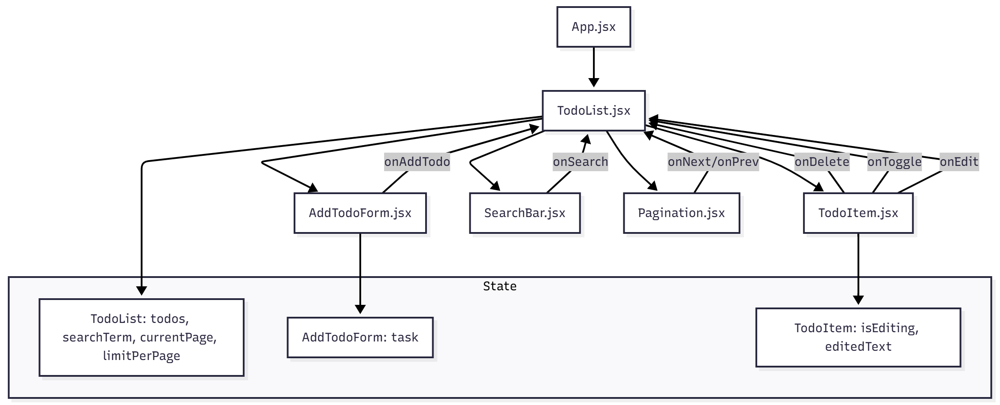

Опис діаграми: Діаграма показує структуру компонентів React-додатку "To-Do List". App.jsx рендерить TodoList.jsx, який виступає як контейнер і керує станом задач (todos), пошуку (searchTerm), пагінації (currentPage, limitPerPage) та передає callback-функції через props до дочірніх компонентів: AddTodoForm.jsx, TodoItem.jsx, SearchBar.jsx, Pagination.jsx. У кожному компоненті показано локальний state, а стрілки з підписами демонструють передачу функцій для додавання, редагування, видалення, пошуку та навігації між сторінками.